# 📻 Product Requirements Document (PRD)
## Proyek: Suara Fajar Deliksari — Live Audio Streaming Radio & Komunitas Doa Pagi

---

## 1. Executive Summary & Visi Produk

**Suara Fajar Deliksari** adalah platform siaran radio web interaktif khusus ibadah dan doa fajar jemaat **Gereja Isa Almasih (GIA) Deliksari Semarang**. Platform ini menggantikan siaran radio konvensional dengan siaran audio WebRTC berlatensi ultra-rendah (<500ms), dilengkapi interaksi komunitas real-time (Dinding Doa, Reaksi Iman, dan Indikator Persekutuan).

### 🎯 Tujuan Utama
1. Memberikan akses audio siaran doa pagi yang jernih, stabil, dan tanpa jeda buffering (real-time WebRTC).
2. Membangun atmosfer persekutuan digital di waktu fajar melalui interaksi permohonan doa langsung dan reaksi emoji jemaat.
3. Menyediakan kontrol siaran all-in-one yang mudah digunakan bagi operator/penyiar (mikrofon live, pantau jemaat, manajemen doa).

---

## 2. Target Pengguna & Persona

| Persona | Kebutuhan & Peran |
| :--- | :--- |
| **Jemaat / Pendengar (Audience)** | Mengikuti doa pagi dari rumah via smartphone/laptop; mendengarkan suara firman/doa dengan jernih; menitipkan pokok doa; saling mengaminkan doa sesama jemaat. |
| **Penyiar / Pelayan Firman (Operator)** | Melakukan siaran suara langsung dari ruang studio/gereja via mikrofon browser; melihat pokok doa jemaat yang masuk secara live untuk didoakan. |
| **Admin Multimedia** | Mengontrol status siaran (Live / Standby / Selesai), memantau statistik pendengar & reaksi, mengelola sistem. |

---

## 3. Fitur Utama & Kebutuhan Fungsional

### A. Portal Pendengar (`/`)
1. **Hero Live Radio Player**:
   - Status badge siaran dinamis: `LIVE ON AIR` (Merah/Emas Berdenyut) atau `STANDBY / OFF-AIR`.
   - Satu tombol putar (*One-Touch Play*) dengan auto-reconnect LiveKit.
   - Audio visualizer bar animasi responsif saat audio aktif.
   - Kontrol volume slider dan indikator status koneksi audio.
2. **Indikator Jumlah Pendengar (Real-Time Listener Count)**:
   - Heartbeat otomatis setiap 15 detik untuk menghitung jumlah jemaat yang sedang tersambung.
3. **Dinding & Form Titip Doa (Prayer Wall & Request)**:
   - Form input nama dan permohonan doa dengan validasi instan.
   - Feed dinding doa (*live prayer wall*) yang otomatis ter-update via Supabase Realtime saat ada pokok doa baru.
4. **Reaksi Iman Real-time (Faith Reactions)**:
   - Pilihan reaksi bermakna: 🙏 *Amin / Doa*, ❤️ *Kasih*, 🕊️ *Damai Sejahtera*, ✝️ *Syukur*.
   - Animasi partikel emoji melayang saat ditekan.
   - Counter terdistribusi realtime ke seluruh jemaat.
5. **Jadwal & Rundown Doa Fajar**:
   - Jadwal terstruktur: Musik Pembuka (04:45), Ibadah & Doa (05:00), Musik Penutup (05:30).

### B. Ruang Siaran & Dashboard Admin (`/admin`)
1. **Autentikasi Aman (`/login`)**:
   - Login berbasis PIN Administrator dengan session cookie terenkripsi (`ADMIN_SESSION_SECRET`).
2. **Studio Mikrofon Penyiar (LiveKit Audio Publisher)**:
   - Tombol On-Air / Mute mic langsung dari browser dengan visualizer level suara (VU meter).
   - Pemilihan input mikrofon.
3. **Monitor Permohonan Doa Masuk**:
   - Tampilan pokok doa terbaru secara real-time dengan timestamp rapi agar penyiar dapat langsung membacakan dan mendoakan.
4. **Statistik Interaksi & Pendengar**:
   - Jumlah jemaat aktif dan akumulasi reaksi iman.

---

## 4. Arsitektur Teknis & Alur Data

```mermaid
flowchart TD
    subgraph Broadcaster ["Studio Operator / Admin"]
        Mic[Mikrofon Penyiar] -->|WebRTC Audio Stream| LK_Cloud[LiveKit WebRTC Cloud]
        AdminUI[Panel Admin / Doa] <-->|Realtime Data & Auth| Supa[(Supabase Database)]
    end

    subgraph Listeners ["Jemaat / Pendengar (Web & Mobile)"]
        LK_Cloud -->|Ultra-Low Latency Audio| WebPlayer[Web Audio Receiver]
        WebPlayer -.->|Heartbeat| Supa
        PrayerForm[Form Titip Doa] -->|Insert Chat| Supa
        ReactionBtns[Tombol Reaksi] -->|Increment Counter| Supa
        Supa -->|Realtime Stream| PrayerWall[Dinding Doa Live]
    end
```

---

## 5. Non-Functional Requirements
- **Latensi**: < 500ms audio delivery via LiveKit WebRTC.
- **Responsivitas**: Tampilan mobile-first yang nyaman dibuka dari smartphone jemaat di tempat tidur / meja doa.
- **Kenyamanan Visual**: Nuansa gelap fajar (*Fajar Kasih*) dengan aksen emas yang menenangkan mata di pagi hari (jam 04:00 - 06:00).
- **Keamanan**: RLS (Row Level Security) pada PostgreSQL Supabase dan proteksi cookie httpOnly untuk admin.
