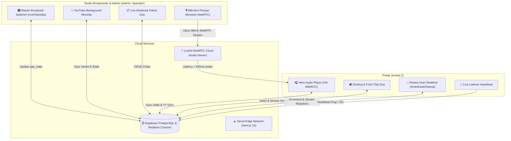

# 📻 Product Requirements Document (PRD)
# Suara Fajar Deliksari — Next-Gen Audio Live Streaming & Interaksi Komunitas Doa Pagi

---

## 1. Executive Summary

**Suara Fajar Deliksari** adalah aplikasi web siaran langsung (*live-streaming audio*) berlatensi ultra-rendah (<500ms) berbasis WebRTC yang dikembangkan untuk **Gereja Isa Almasih (GIA) Deliksari Semarang**. Aplikasi ini bertujuan untuk memfasilitasi doa fajar harian (pukul 04.45 – 05.45 WIB), menghubungkan jemaat dari rumah secara interaktif melalui firman, doa syafaat langsung, dinding doa real-time, dan respon iman digital.

---

## 2. Latar Belakang & Analisis Masalah

1. **Keterbatasan Radio Konvensional / Audio Streaming Biasa (HLS/Icecast)**:
   - Delay buffering 10-30 detik membuat interaksi doa dua arah menjadi canggung.
   - Tidak ada integrasi pokok doa jemaat dan statistik kehadiran jemaat saat itu juga.
2. **Kebutuhan Jemaat di Waktu Fajar**:
   - Tampilan ramah mata di waktu subuh/gelap (*Dark Dawn Theme*).
   - Akses mudah satu sentuhan (*one-touch play*) tanpa harus install aplikasi rumit.
   - Saluran penyampaian pokok permohonan doa yang langsung dibaca oleh pelayan firman/penyiar di studio.
3. **Kebutuhan Operator / Multimedia Gereja**:
   - Studio siaran mikrofon yang dapat diakses langsung dari browser tanpa setup OBS / kabel rumit.
   - Sinkronisasi instan antara audio suara penyiar dan musik pengiring (YouTube worship setlist).

---

## 3. Persona Pengguna

| Persona | Profil & Peran | Kebutuhan Utama |
| :--- | :--- | :--- |
| **Jemaat / Pendengar** | Jemaat GIA Deliksari & simpatisan yang mengikuti doa fajar via HP/laptop. | Mendengarkan audio jernih tanpa putus, menitipkan pokok doa fajar, saling mengaminkan doa jemaat lain, melihat jadwal ibadah. |
| **Penyiar / Pelayan Firman** | Pendeta, penatua, atau pelayan ibadah yang membawakan renungan & doa. | Menyalakan mic siaran langsung dari HP/laptop, membaca pokok doa jemaat yang masuk secara live di studio. |
| **Operator Multimedia / Admin** | Tim multimedia gereja pengelola teknis siaran. | Mengontrol master state siaran (On-Air / Standby), mengelola musik latar YouTube / Setlist, memantau jumlah pendengar. |

---

## 4. Arsitektur Sistem & Alur Data

---

## 5. Rincian Kebutuhan Fungsional

### A. Portal Pendengar Jemaat (`/`)
1. **Hero WebRTC Audio Receiver**:
   - Auto-fetch token subscriber LiveKit untuk room `suara-fajar-deliksari`.
   - Tombol Play/Pause dengan feedback visual gelombang suara (*audio waveform frequency bars*).
   - Pengatur volume (0-100%) dan tombol mute instan.
   - Status badge siaran dinamis: `LIVE ON AIR` (Merah/Emas Berdenyut) atau `STANDBY`.
2. **Sinkronisasi Musik Latar (YouTube Worship Sync)**:
   - Jika admin mengaktifkan background musik di studio, audio YouTube sinkron dengan tampilan judul lagu yang sedang diputar.
3. **Persekutuan Doa Fajar (Dinding Doa & Form Titip Doa)**:
   - **Form Input**: Nama Jemaat + Pokok Doa (maks. 500 karakter) dengan validasi otomatis dan perhitungan inisial avatar.
   - **Dinding Doa Live**: Feed 20 pokok doa terbaru yang otomatis muncul di layar jemaat saat ada yang mengirimkan doa baru (*Zero-Refresh* via Supabase Realtime).
4. **Reaksi Iman Cepat (Faith Reactions)**:
   - 4 Reaksi bermakna: 🙏 *Amin* (Doa Terkabul), ❤️ *Kasih* (Kasih Kristus), 🕊️ *Damai* (Damai Sejahtera), ✝️ *Syukur* (Puji Tuhan).
   - Animasi partikel melayang (*floating burst*) saat tombol ditekan.
   - Sinkronisasi realtime counter akumulasi seluruh jemaat.
5. **Indikator Jumlah Jemaat Bersama (Realtime Listener Heartbeat)**:
   - Pengecekan denyut aktif (heartbeat) setiap 15 detik ke tabel `listeners`.
   - Menghitung jemaat aktif dalam rentang 60 detik terakhir (*"X Jemaat Berdoa Bersama"*).
6. **Rundown Jadwal Doa Fajar**:
   - 04:45 - 05:00 WIB: Musik Fajar & Pujian Persiapan
   - 05:00 - 05:30 WIB: Ibadah, Renungan Firman & Doa Syafaat
   - 05:30 - 05:45 WIB: Pujian Berkat & Doa Penutup
   - Penanda otomatis (*"BERLANGSUNG"*) jika jam sistem masuk dalam rentang tersebut.

---

### B. Studio Penyiar & Dashboard Admin (`/admin` & `/operator`)
1. **Autentikasi & Proteksi Keamanan (`/login`)**:
   - PIN Access Gate (`ADMIN_PIN`, default `9900`) dengan session cookie terenkripsi (`ADMIN_SESSION_SECRET`).
2. **Studio Mikrofon Penyiar (LiveKit Publisher)**:
   - Tombol mikrofon On-Air / Mic Off berukuran besar dengan visualizer level suara.
   - Izin mikrofon browser otomatis dan indikator kualitas koneksi.
3. **Master Broadcast Controller (`app_state`)**:
   - Tombol On-Air / Standby untuk mengubah status global siaran.
   - Pengaturan volume siaran utama dan kontrol sinkronisasi media.
4. **Manajemen Musik Latar & YouTube Setlist (`setlist`)**:
   - Input URL YouTube untuk memutar lagu pujian pengiring doa.
   - Antrian setlist lagu ibadah fajar.
5. **Panel Moderasi Permohonan Doa Jemaat (`chats`)**:
   - Daftar pokok doa real-time dengan inisial dan jam kirim.
   - Fitur *"Tandai Didoakan"* agar pelayan firman dapat menandai pokok doa yang sudah dibacakan dalam doa syafaat.
6. **Statistik & Monitoring Sesi**:
   - Monitor jumlah jemaat tersambung dan total reaksi iman.

---

## 6. Struktur Skema Database Supabase

| Tabel | Kolom Utama | Fungsi |
| :--- | :--- | :--- |
| `app_state` | `id=1`, `is_live`, `is_demo`, `media_on`, `mic_on`, `youtube_on`, `current_youtube_id`, `current_youtube_title`, `volume`, `updated_at` | State global siaran satu baris yang disinkronkan ke seluruh klien. |
| `chats` | `id`, `created_at`, `initial`, `name`, `message` | Daftar permohonan doa jemaat secara real-time. |
| `reactions` | `emoji` (PK), `label`, `count`, `reset_date` | Counter akumulasi reaksi jemaat. |
| `setlist` | `id`, `position`, `youtube_id`, `title`, `is_playing`, `created_at` | Antrian lagu ibadah / pujian latar. |
| `listeners` | `client_id` (PK), `last_seen` | Tracking heartbeat pendengar aktif. |

---

## 7. Metrik Keberhasilan Produk (Success Metrics)
- **Audio Latency**: < 500ms dari studio penyiar hingga terdengar di HP jemaat.
- **Realtime Latency**: < 300ms dari saat jemaat mengirimkan pokok doa hingga tampil di layar studio penyiar.
- **Uptime & Reconnect**: 99.9% auto-reconnection jika terjadi gangguan sinyal seluler pada HP jemaat.
- **Usability Score**: Jemaat usia lanjut dapat menyalakan siaran dengan 1 kali klik.
